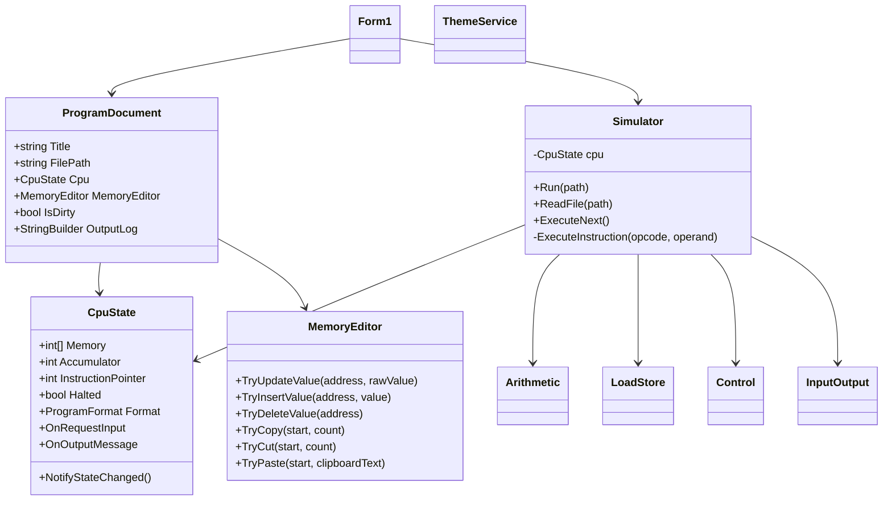

# UV SIM Final Project Submission

**Course:** _[Enter Course Name]_  
**Project:** UV SIM Machine-Level Instruction Simulator  
**Team:** Group 4  
**Client/Stakeholders:** _[Enter Client Name]_  
**Submission Date:** April 22, 2026  
**Prepared By:** _[Enter Team Member Names]_

---

## Table of Contents

1. [Introduction / Executive Summary](#1-introduction--executive-summary)
2. [User Stories and Use Cases](#2-user-stories-and-use-cases)
3. [Functional Specifications (Final SRS)](#3-functional-specifications-final-srs)
4. [Class Diagrams and GUI Wireframes](#4-class-diagrams-and-gui-wireframes)
5. [Unit Test Descriptions](#5-unit-test-descriptions)
6. [Application Instructions (User Manual)](#6-application-instructions-user-manual)
7. [Future Road Map](#7-future-road-map)
8. [Appendices and Supporting Deliverables](#8-appendices-and-supporting-deliverables)

---

## 1. Introduction / Executive Summary

UV SIM is a desktop application for simulating machine-level programs in a controlled educational environment. The system supports loading, editing, executing, and saving instruction-based programs while exposing memory state, accumulator state, and instruction flow through a graphical interface. The simulator is designed to support both legacy 4-digit and extended 6-digit instruction formats, allowing the same platform to support multiple classroom workflows and assignment formats.

This final submission document consolidates all major project documentation into one cohesive source for client review. It includes user stories/use cases, final functional requirements (SRS), architecture/class-level design, GUI wireframe references, unit test coverage descriptions, an expanded user manual, and a proposed future roadmap. Existing course artifacts (design document, class definition document, and meeting report) are listed in appendices so this final package can serve as a complete milestone handoff.

---

## 2. User Stories and Use Cases

### 2.1 Primary User Stories

1. **As a student**, I want to load a text-based program file so I can run assignment programs in the simulator.
2. **As a student**, I want to edit memory directly in the grid so I can test instruction changes quickly.
3. **As a student**, I want to run one open program at a time so I can isolate behavior by tab.
4. **As a student**, I want to open multiple programs in separate tabs so I can compare outputs and state.
5. **As a student**, I want clear input prompts for READ operations so I can continue execution without confusion.
6. **As a student**, I want visible output logs for WRITE operations so I can validate program behavior.
7. **As an instructor**, I want the simulator to enforce valid instruction/value ranges so invalid input is caught early.
8. **As an instructor**, I want both 4-digit and 6-digit formats supported so the tool works across class sections.
9. **As a user**, I want to save current memory contents to a file so I can submit and re-open my work.
10. **As a user**, I want theme customization so I can improve readability/accessibility preferences.

### 2.2 Use Case Summary

| Use Case ID | Name | Primary Actor | Preconditions | Success Outcome |
|---|---|---|---|---|
| UC-01 | Load Program | Student | App is running | Program loaded into new tab memory |
| UC-02 | Edit Memory Cell(s) | Student | Tab/document exists | Memory values updated and marked dirty |
| UC-03 | Run Program | Student | Valid instructions in memory | Program executes until HALT or termination condition |
| UC-04 | Handle Program Input | Student | Running program issues READ | Input captured and stored to target memory |
| UC-05 | Save Program | Student | Open tab has memory data | Memory exported to `.txt` |
| UC-06 | Manage Tabs | Student | App is running | Tabs can be created/switched/closed safely |
| UC-07 | Copy/Cut/Paste Block | Student | Valid contiguous memory selected | Block operation applied with validation |
| UC-08 | Change Theme | Student | App is running | Theme applied and saved |

### 2.3 Detailed Use Cases (Condensed)

#### UC-01: Load Program
- **Trigger:** User clicks **Load**.
- **Main Flow:** User chooses a file; system validates format consistency (4-digit or 6-digit), checks size limits, clears current state, and loads memory.
- **Alternate/Exception Flows:** Missing file, empty file, mixed formats, and non-numeric lines generate error feedback.

#### UC-03: Run Program
- **Trigger:** User clicks **Run**.
- **Main Flow:** System executes instructions from the active tab’s CPU state and updates UI as state changes.
- **Alternate/Exception Flows:** Invalid addresses/operands are safely handled by operation logic and tests; execution stops when HALT is encountered or when bounds are exceeded.

#### UC-07: Copy/Cut/Paste Block
- **Trigger:** User uses toolbar actions.
- **Main Flow:** System validates contiguous selection, validates pasted values/range/size, then applies operation.
- **Alternate/Exception Flows:** Empty clipboard, invalid numeric format, non-contiguous selection, and out-of-range paste produce user-visible errors.

---

## 3. Functional Specifications (Final SRS)

### 3.1 Scope
The UV SIM application provides instruction simulation, memory management, and multi-document program workflows in a desktop GUI environment.

### 3.2 Functional Requirements (FR)

| ID | Requirement |
|---|---|
| FR-01 | System shall support loading instruction files into memory from disk. |
| FR-02 | System shall auto-detect and enforce either legacy 4-digit or extended 6-digit file format per document. |
| FR-03 | System shall reject mixed-format file contents within a single program load. |
| FR-04 | System shall allow direct memory editing with validation of address and value ranges. |
| FR-05 | System shall provide copy, cut, paste, insert, and delete memory editing operations. |
| FR-06 | System shall support program execution instruction-by-instruction via simulator operation handlers. |
| FR-07 | System shall support READ input prompts and WRITE output logging. |
| FR-08 | System shall support core opcodes for I/O, load/store, arithmetic, branch control, and HALT. |
| FR-09 | System shall maintain separate memory/register/output state per open tab/document. |
| FR-10 | System shall allow users to save memory/program contents to text files. |
| FR-11 | System shall provide configurable theme settings and a reset-to-default theme option. |
| FR-12 | System shall update GUI memory/state views when CPU state changes. |

### 3.3 Non-Functional Requirements (NFR)

| ID | Requirement |
|---|---|
| NFR-01 | **Usability:** UI shall present memory and execution controls in a clear dashboard layout. |
| NFR-02 | **Reliability:** Invalid addresses and invalid arithmetic conditions (e.g., divide by zero, overflow checks) shall not crash execution. |
| NFR-03 | **Maintainability:** Instruction behavior shall remain modular via operation classes (Arithmetic, LoadStore, Control, InputOutput). |
| NFR-04 | **Compatibility:** Application shall run in the .NET desktop environment and support local filesystem operations. |
| NFR-05 | **Testability:** Core operation paths shall be covered by automated unit tests. |

### 3.4 Assumptions and Constraints
- Input programs are newline-separated integer words.
- Supported word sizes are 4-digit and 6-digit instruction/value conventions.
- Maximum memory size depends on selected program format.
- Environment is desktop-first (Windows-focused usage for GUI and input dialogs).

---

## 4. Class Diagrams and GUI Wireframes

### 4.1 Class-Level Design Summary

Core classes and responsibilities:
- **`CpuState`**: Memory array, accumulator, instruction pointer, halted flag, format flag, and UI callback hooks.
- **`Simulator`**: File loading, format detection/validation, decode/dispatch, step execution.
- **Operation Modules**: `Arithmetic`, `LoadStore`, `Control`, `InputOutput` implement opcode behavior.
- **`Form1`**: Main GUI orchestration, tab/document management, grid rendering, toolbar handlers.
- **`ProgramDocument`**: Encapsulates per-tab CPU, memory editor, output log, and metadata.
- **`MemoryEditor`**: Validated memory edit operations (update/insert/delete/copy/cut/paste).
- **`ThemeService`**: Theme persistence and defaults.

### 4.2 Text UML (Consolidated)



### 4.3 GUI Wireframes and Visual References

The following visuals are included from the project’s image assets and should be treated as final wireframe/UI references:

1. **Main Simulator Dashboard**  
   
2. **6-digit Program Example**  
   
3. **Input Prompt Example**  
   
4. **Single Cell Selection**  
   
5. **Multiple Cell Selection**  
   
6. **Toolbar Actions**  
   
7. **Theme Selection**  
   

Additional source artifacts retained in repository:
- `Class def doc.pdf` (class diagram material)
- `Design doc uvsim.pdf` (design/wireframe context)

---

## 5. Unit Test Descriptions

The project includes **43 unit tests** covering simulator operations, memory behaviors, tab state isolation, and output behavior.

### 5.1 Test Suite Totals
- AddInstructionTests: 2
- ArithmeticTests: 15
- ConsoleTests: 6
- ControlTests: 5
- LoadStoreTests: 10
- TabsStateTests: 3
- WriteInstructionTests: 2

**Total: 43**

### 5.2 Test Coverage by Area

#### A) Arithmetic & Overflow Handling
- Valid and invalid ADD/SUBTRACT/MULTIPLY/DIVIDE behaviors
- Legacy and extended format address handling
- Overflow protections
- Division by zero safety

#### B) Load/Store
- Valid store/load operations in both formats
- Invalid/negative address handling
- Proper instruction pointer advancement

#### C) Control Flow
- BRANCH unconditional jump
- BRANCHZERO conditionally jumps on zero accumulator
- BRANCHNEG conditionally jumps on negative accumulator

#### D) Console I/O
- READ stores input and enforces range constraints
- WRITE outputs correctly formatted memory values
- Invalid address handling remains safe

#### E) Multi-Tab/State Isolation
- Independent memory, register, and output states per CPU/document context

### 5.3 Per-Test Descriptions

> Full per-test narrative content has been consolidated from `info.md` and is included as the canonical unit-test description source for this submission.

---

## 6. Application Instructions (User Manual)

This polished user manual consolidates and formalizes operational steps from the existing README.

### 6.1 Installation and Launch

From repository root:

```powershell
dotnet restore
dotnet run --project .\UVGUI\UVGUI.csproj
```

This restores dependencies and launches the GUI simulator.

### 6.2 Main Interface Overview

The application opens with a dashboard that exposes:
- Memory grid (address + value display)
- Program tabs
- Execution controls
- Output area
- Toolbar editing actions


### 6.3 Tabs and Program Management

- Each tab is an independent program document.
- Each document has isolated memory, registers, and output log.
- Loading a file creates a new tab.
- Closing all tabs automatically creates a fresh blank tab.

### 6.4 Loading Programs

1. Click **Load**.
2. Select a valid instruction text file.
3. App auto-detects 4-digit or 6-digit format and updates display rules.

If a file is mixed-format, malformed, empty, or too long, the app rejects it with an error.


### 6.5 Editing Memory

- Click a value cell to edit one location.
- Select contiguous cells for block operations.
- Use toolbar options to **Delete**, **Copy**, **Cut**, **Paste**.


### 6.6 Running Programs

1. Ensure desired tab is active.
2. Click **Run**.
3. Program executes until HALT or stop condition.

Only the active tab runs; other tabs remain unchanged.

### 6.7 Input and Output

- `READ` instructions prompt with an input dialog.
- `WRITE` instructions append output to the active document output log.


### 6.8 Saving Programs

- Click **Save** to export the current document memory to a `.txt` file.
- Save behavior writes populated memory content appropriate for simulator conventions.

### 6.9 Theme Customization

- Click **Theme** to choose custom primary/secondary colors.
- Click **Reset Theme** to return default appearance.


### 6.10 Error Handling Guidance

Typical validation and runtime safeguards include:
- Invalid address checks
- Value range checks
- Non-contiguous selection rejection for block actions
- Paste overflow prevention
- File format consistency checks

---

## 7. Future Road Map

Potential follow-on enhancements:

1. **Step Debugger Enhancements**
   - Breakpoints, watch expressions, and instruction trace timeline.
2. **Improved File Interop**
   - Import/export profiles, sample library browser, JSON-based project bundles.
3. **Extended ISA Support**
   - Additional opcodes and macro/pseudo-instruction expansion.
4. **Execution Analytics**
   - Runtime stats (instruction counts, branch frequency, memory hotspots).
5. **Cross-Platform UX Path**
   - Evaluate Avalonia/MAUI for broader OS support.
6. **Web Companion Option**
   - Browser-hosted simulator for classroom/lab accessibility.
7. **Accessibility Upgrades**
   - High-contrast preset themes, keyboard-only command palette, screen-reader labels.
8. **Instructor Tools**
   - Assignment mode, autograding hooks, and run-result export.

---

## 8. Appendices and Supporting Deliverables

### 8.1 Included Core Documents
- `README.md` (source user manual content)
- `info.md` (unit test descriptions)
- `Design doc uvsim.pdf` (design document)
- `Class def doc.pdf` (class definition/class diagram document)
- `Meeting Report.pdf` (meeting records)

### 8.2 Final Submission Checklist
- [x] Cover page
- [x] Table of contents
- [x] Executive summary
- [x] User stories / use cases
- [x] Final SRS functional specs
- [x] Class diagram summary + GUI wireframe references
- [x] Unit test descriptions
- [x] Polished user manual with screenshots
- [x] Future roadmap
- [x] Supporting document list

---

### Notes for Team Before Submission
- Replace placeholder bracketed values on the cover page.
- If your instructor requires a DOCX/PDF deliverable, export this Markdown to the requested format.
- Keep this file (`FINAL_PROJECT_SUBMISSION.md`) as the canonical source for future edits.
